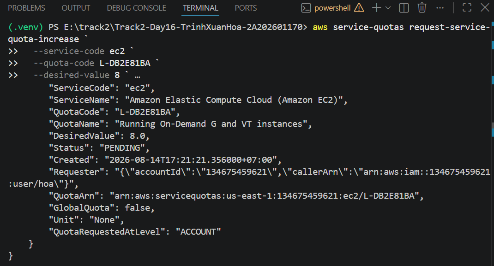
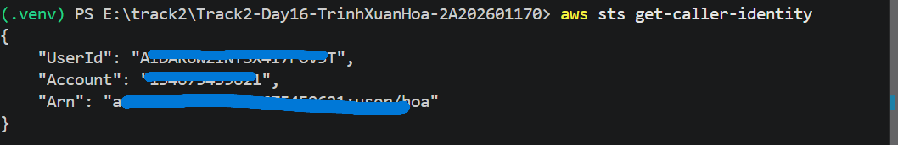
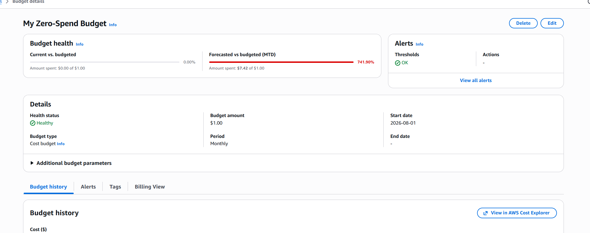
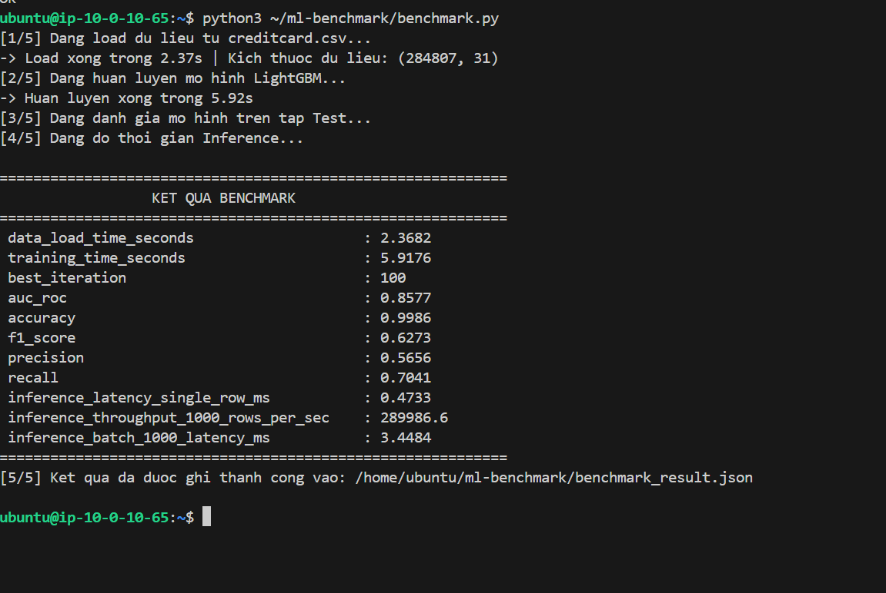
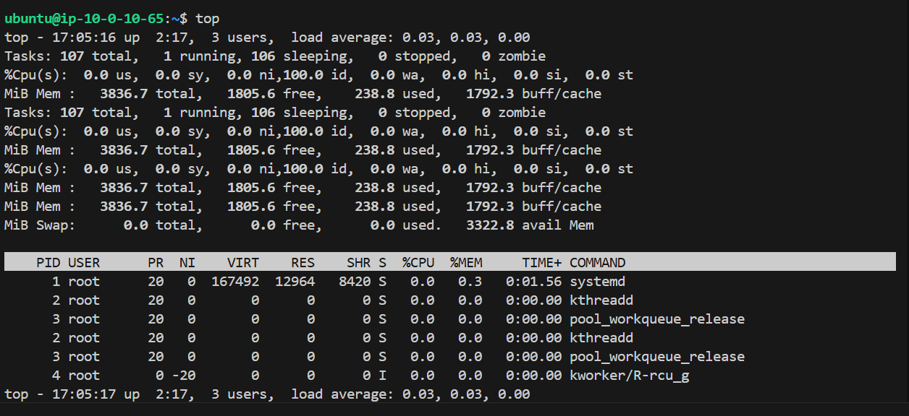
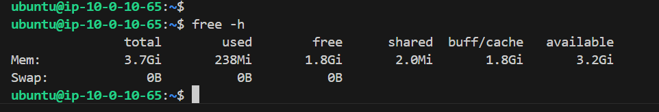
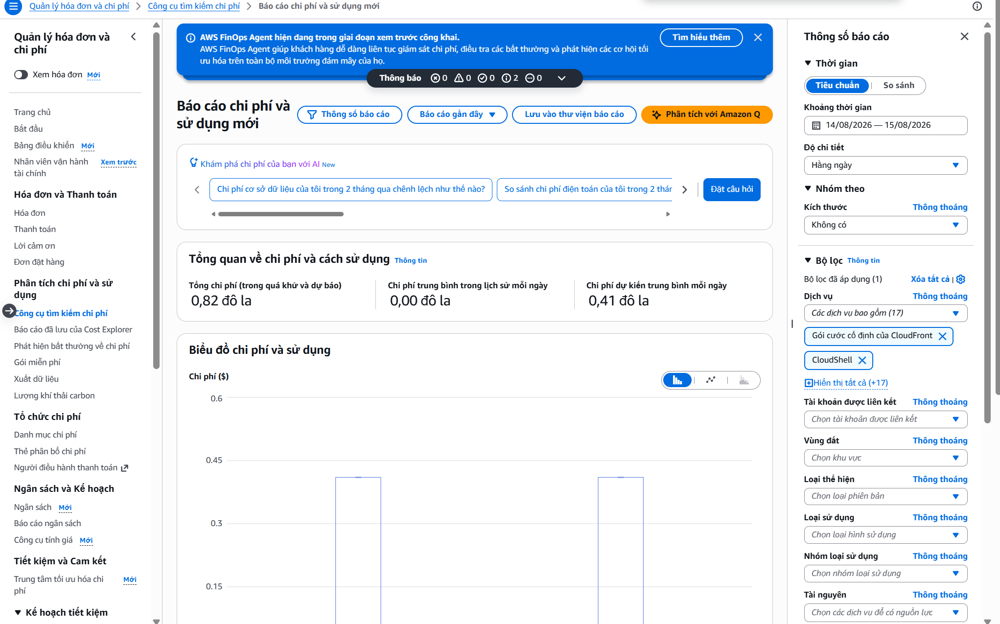
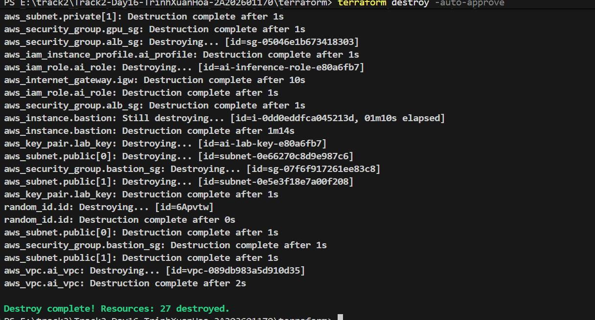

# Day 16 Readiness & Lab Evidence — 2A202601170 (Trịnh Xuân Hòa)

## 1. Thông tin tổng quan (Checklist Readiness)

- **MSSV / Họ tên:** 2A202601170 — Trịnh Xuân Hòa
- **Cloud path chính:** AWS (`us-east-1`)
- **Cloud identity:** IAM User `ai-lab-user` / `hoa` (Account: `***59621` — *đã che thông tin nhạy cảm*)
- **Budget alert:** Đã cấu hình AWS Budget Alert với email nhận thông báo khi chi phí đạt ngưỡng ($1.00 Zero-Spend).
- **CLI & Tools:**
  - `aws-cli`: Đã cấu hình và xác thực danh tính qua `aws sts get-caller-identity`.
  - `terraform`: Version >= 1.5.0 hoạt động chính xác.
  - `python`: Python 3.10+ (môi trường ảo `.venv` đã kích hoạt).
  - `git`, `curl`: Đã cài đặt và kiểm tra version.
  - `docker`: Pending (sẵn sàng hoàn tất trước Day 18).
- **Bảo mật Secrets & Token:**
  - Hugging Face Token & AWS Access Keys được lưu trữ an toàn trong biến môi trường / `.env`.
  - File `.env`, `.tfstate`, `lab-key` đã được đưa vào `.gitignore`, không đưa lên Git.
- **GPU Quota & Phương án Fallback:**
  - Trạng thái GPU Quota: Đang yêu cầu / Pending (8 vCPU).
  - Phương án: Sử dụng **CPU Mode Fallback** (`t3.medium`) trong Private VPC theo đúng chuẩn yêu cầu bài Lab 16.
- **Trạng thái tài nguyên:** Đã chạy `terraform destroy -auto-approve` dọn dẹp sạch sẽ 27/27 tài nguyên, không còn tài nguyên tính phí tồn đọng.

---

## 2. Kết quả Thực hành Lab 16 (LightGBM on AWS CPU Instance)

### 2.1. Kiến trúc Hạ tầng Triển khai (Terraform)
- **VPC:** `10.0.0.0/16` cách ly hoàn toàn.
- **Public Subnet:** Chứa Bastion Host (`t3.micro`) và NAT Gateway.
- **Private Subnet:** Chứa Compute Node (`t3.medium` - 2 vCPU, 4GB RAM).
- **Bảo mật:** Security Group chỉ cho phép SSH từ Bastion Host sang Compute Node, mở cổng ALB phục vụ inference.

### 2.2. Kết quả Benchmark Mô hình LightGBM
*Bộ dữ liệu: Credit Card Fraud Detection (284,807 mẫu).*

```json
{
    "data_load_time_seconds": 2.3682,
    "training_time_seconds": 5.9176,
    "best_iteration": 100,
    "auc_roc": 0.8577,
    "accuracy": 0.9986,
    "f1_score": 0.6273,
    "precision": 0.5656,
    "recall": 0.7041,
    "inference_latency_single_row_ms": 0.4733,
    "inference_throughput_1000_rows_per_sec": 289986.6,
    "inference_batch_1000_latency_ms": 3.4484
}
```

### 2.3. Đánh giá & Nhận xét Hiệu năng
- **Tốc độ xử lý dữ liệu & Huấn luyện:** Thời gian load dataset chỉ mất **2.37s** và hoàn thành huấn luyện 100 round trong **5.92s**. CPU `t3.medium` xử lý rất tốt các thuật toán dạng cây (Tree-based) trên dữ liệu bảng kích thước trung bình.
- **Chất lượng mô hình:** Đạt **Accuracy 99.86%**, **AUC-ROC 0.8577**, **F1-Score 0.6273** (Precision 0.5656, Recall 0.7041) trên tập kiểm thử bị mất cân bằng lớp dữ liệu nghiêm trọng.
- **Hiệu năng Inference:**
  - Single-row latency: **0.47 ms / sample** (cực kỳ thích hợp cho các hệ thống phát hiện gian lận thời gian thực).
  - Batch throughput (1000 rows): Đạt **~289,986 samples / second**.
- **Giám sát tài nguyên:** Mức RAM sử dụng đỉnh điểm ~1.8GB / 3.8GB, CPU peak ~90% trong khi training và hạ về 0% khi nhàn rỗi.

---

## 3. Minh chứng Hình ảnh (Evidence Artifacts)

### 3.1. Cấu hình & Xác thực Ban đầu
- **AWS Quota Request (GPU Pending):**
  
- **AWS Caller Identity (Redacted):**
  
- **AWS Zero-Spend Budget Alert:**
  

### 3.2. Quá trình Chạy Benchmark & Monitoring
- **Kết quả Terminal chạy `benchmark.py`:**
  
- **Giám sát CPU (`top`):**
  
- **Giám sát RAM (`free -h`):**
  
- **AWS Billing / Cost Explorer:**
  

### 3.3. Dọn dẹp Tài nguyên
- **Xác nhận `terraform destroy -auto-approve` (27 resources destroyed):**
  
